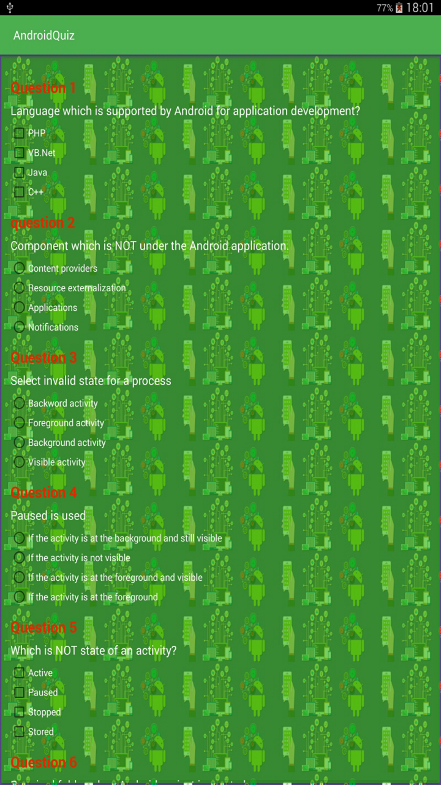
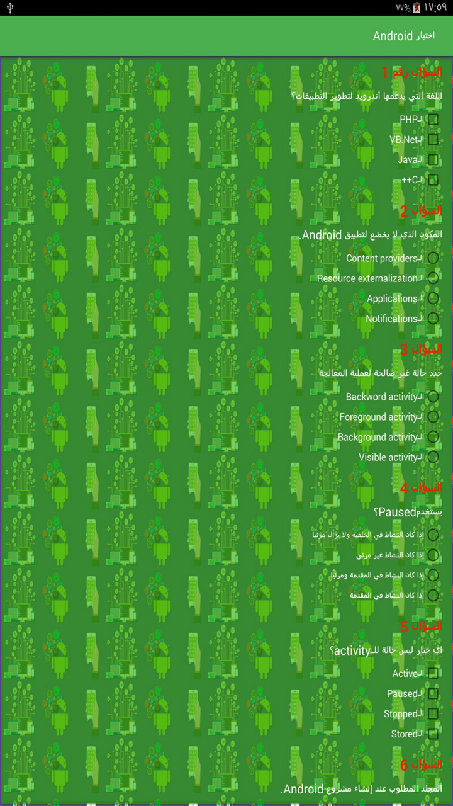
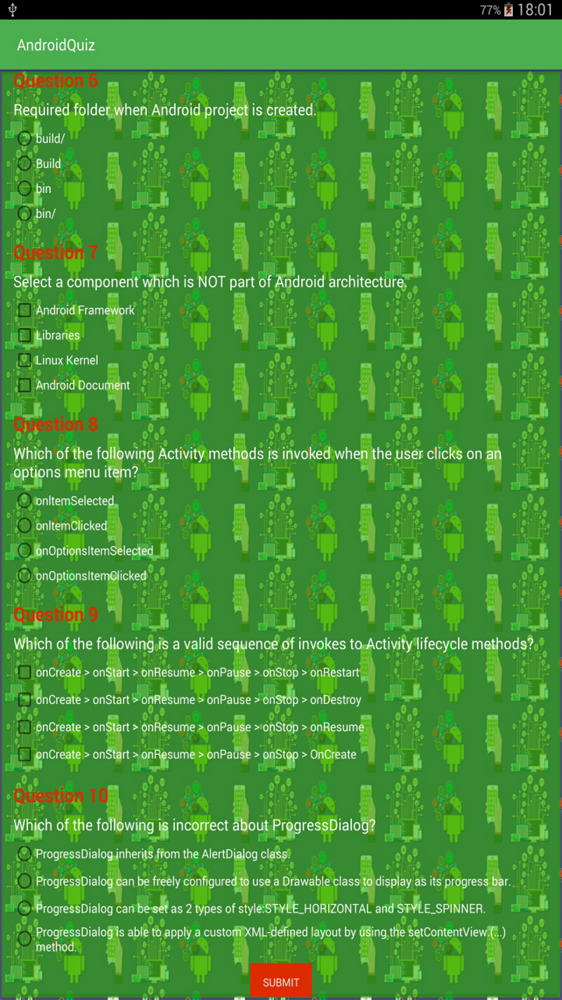
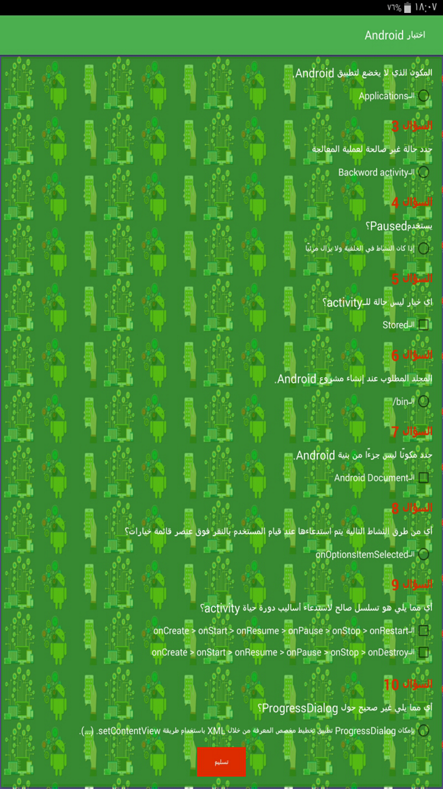
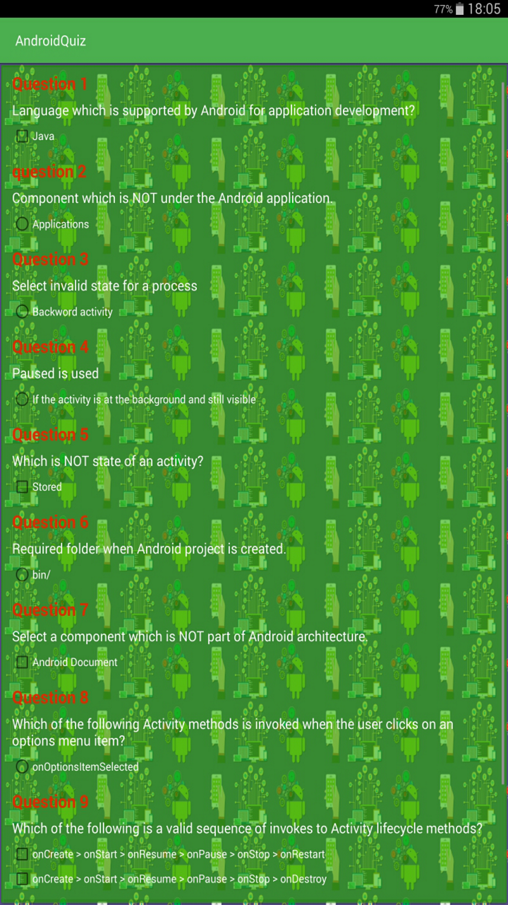
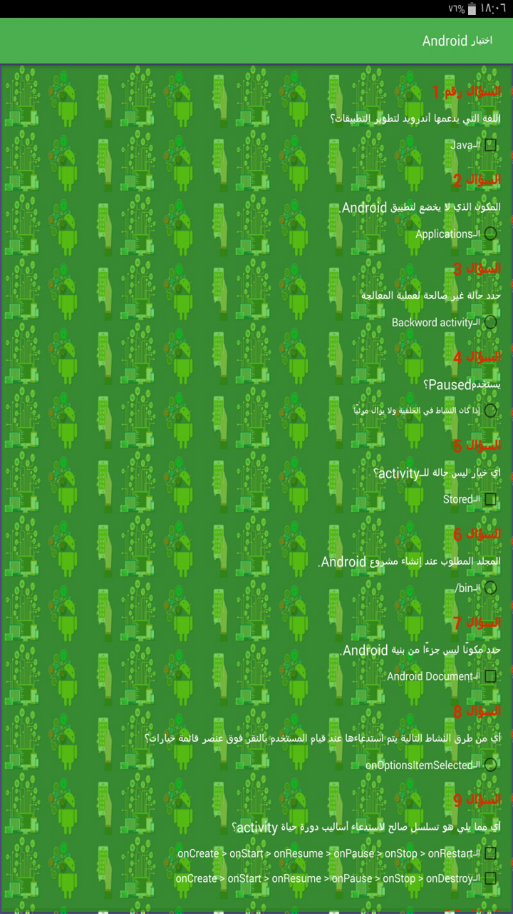
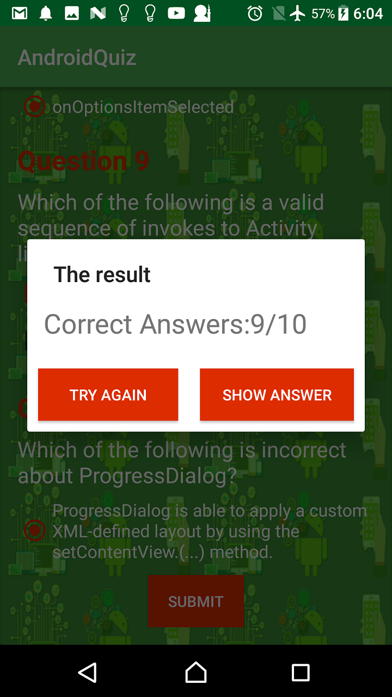
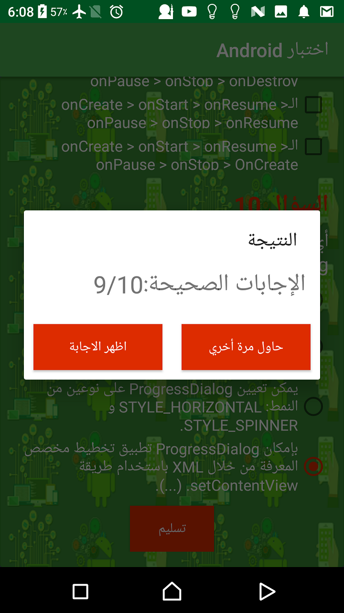
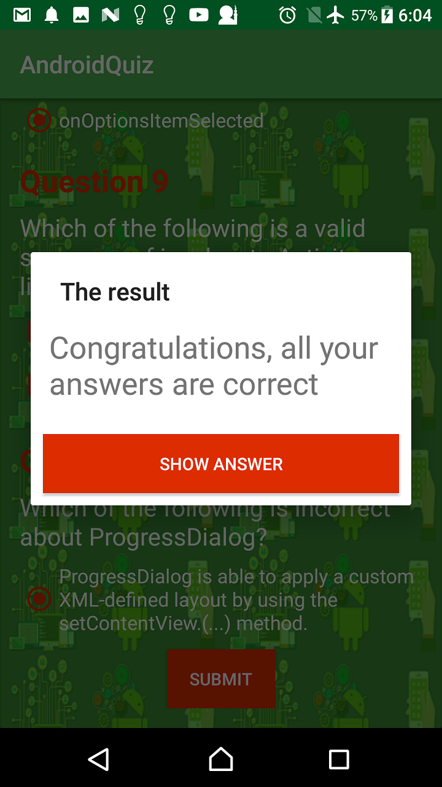
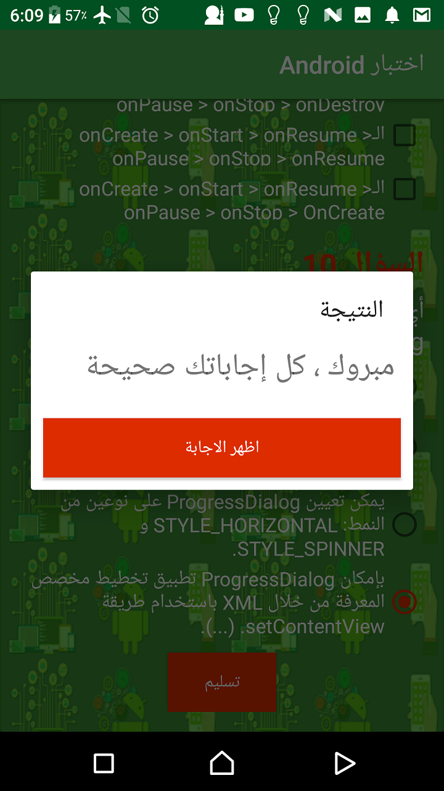

# AndroidQuiz App
Project which comes under Udacity Android Basics Nanodegree Program

# Project Overview
Design and implement a Quize app that displays an educational app that quizzes a user about a certain topic .

# Requirement
1. Game Chosen
2. App contains 4 - 10 questions, including at least one check box, one radio button, and one text entry.
3. Questions are in a variety of formats such as free text response, checkboxes, and radio buttons.
Checkboxes are only used for questions with multiple right answers.
 Radio buttons are only used for questions with a single right answer.
4. App includes a button for the user to submit their answers and receive a score.

## Final Output - Screenshots

English                         | Arabic
:--------------------------------:|:--------------------------------:
  |
  |
  |
  |
  |

# Download
You can download the apk here [AndroidQuiz App](../../raw/master/app/Screenshots/app-debug.apk)
